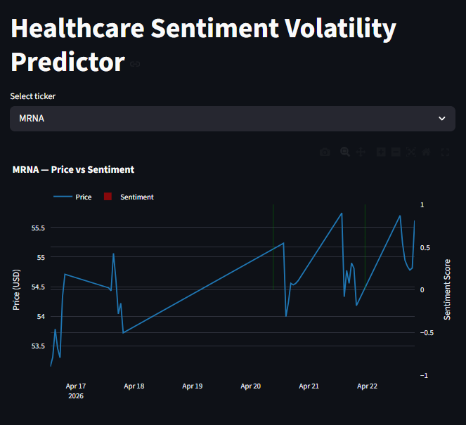
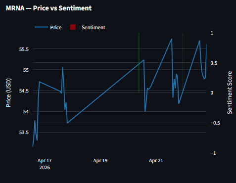
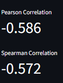

<h1 align="center">💊 Healthcare Sentiment-Driven Volatility Predictor</h1>

<b>Predicting Biotech Price Volatility via Financial NLP and Sentiment Analysis</b>

<h2>📊 Dashboard Preview</h2>

<i>Select any biotech ticker from the dropdown to view the real-time sentiment signal 
overlaid on the intraday price chart.</i>

  

<h2>📄 Abstract</h2>

This project investigates whether NLP-derived sentiment signals extracted from 
financial news headlines can predict intraday price volatility in mid-cap 
biotech and pharmaceutical stocks. Using <b>FinBERT</b> — a transformer model 
pre-trained on financial corpora — we compute FinBERT scores on recent headlines for a fixed universe of 
ten biotech tickers and relate them to short-horizon realized volatility 
(rolling standard deviation of log returns on hourly bars). A Welch 
<i>t</i>-test contrasts volatility when |sentiment| &gt; 0.5 versus otherwise.

Results are visualized in an interactive <b>Streamlit dashboard</b> with 
Pearson and Spearman correlations for sentiment vs realized volatility (and 
price level for context).

<h2>📚 Table of Contents</h2>
<ul>
<li><a href="#motivation">Motivation</a></li>
<li><a href="#tech-stack">Tech Stack</a></li>
<li><a href="#project-architecture">Project Architecture</a></li>
<li><a href="#methodology">Methodology</a></li>
<li><a href="#research-loop">Research Loop</a></li>
<li><a href="#findings">Findings</a></li>
<li><a href="#getting-started">Getting Started</a></li>
<li><a href="#project-structure">Project Structure</a></li>
<li><a href="#limitations">Limitations & Future Work</a></li>
<li><a href="#license">License</a></li>
</ul>

<h2 id="motivation">🎯 Motivation</h2>

Biotech stocks are uniquely sensitive to news — FDA rulings, clinical trial 
results, and earnings surprises can cause 20–40% single-day moves.

Unlike large-cap equities where price is driven by macro factors, mid-cap biotech 
price action is heavily narrative-driven, making it an ideal domain for 
NLP-powered research.

Standard sentiment tools like VADER or TextBlob are trained on general-purpose 
text and frequently misclassify financial language. FinBERT, trained on financial 
news and SEC filings, handles this domain-specific language correctly.

<h2 id="tech-stack">🛠️ Tech Stack</h2>

<table border="1" cellpadding="8">
<tr>
<th>Layer</th>
<th>Tool</th>
</tr>
<tr><td>Price Data</td><td>yfinance</td></tr>
<tr><td>News Headlines</td><td>GNews API</td></tr>
<tr><td>NLP Model</td><td>ProsusAI/FinBERT (HuggingFace)</td></tr>
<tr><td>Data Storage</td><td>SQLite (SQLAlchemy)</td></tr>
<tr><td>Analysis</td><td>pandas, numpy, scipy</td></tr>
<tr><td>Dashboard</td><td>Streamlit + Plotly</td></tr>
</table>

<h2 id="project-architecture">🏗️ Project Architecture</h2>

<pre>
News Headlines ──► Preprocessing ──► FinBERT Inference ──► Sentiment Score
      │
Stock Prices ──► Time Alignment
      │
Correlation Analysis
      │
Streamlit Dashboard
</pre>

<h2 id="methodology">📐 Methodology</h2>

<h3>1. Ticker Universe</h3>

MRNA, VRTX, BNTX, REGN, BIIB, ALNY, INCY, BMRN, SGEN, HZNP

<h3>2. Sentiment Scoring</h3>

FinBERT outputs probabilities for positive, negative, and neutral sentiment:

<pre>
Sentiment Score = P(positive) - P(negative) ∈ [-1, 1]
</pre>

<h3>3. Time Alignment</h3>

Headlines are aligned with price bars using <code>pandas.merge_asof</code>: 
backward merge for batch stats (use news available at each bar time), and 
nearest merge in the dashboard for exploratory overlays.

<h3>4. Hypothesis Testing</h3>

<b>H₀:</b> Sentiment spikes have no effect on volatility 
<b>H₁:</b> Sentiment spikes lead to increased volatility

<h3>5. Correlation Analysis</h3>

Pearson and Spearman correlations are computed between sentiment and the 
rolling volatility series per ticker. The Streamlit app also shows sentiment 
vs price level for intuition (non-stationary; interpret cautiously).

<h2 id="research-loop">🧪 Research Loop</h2>

The repository now includes a reproducible experiment loop to support portfolio-grade
results and out-of-sample claims:

<ol>
<li><b>Build features</b>: sentiment, lagged volatility, rolling volatility means.</li>
<li><b>Train baselines</b>: lag-vol, rolling-mean, train-mean/prevalence, random.</li>
<li><b>Train FinBERT-informed model</b>: linear model using sentiment + volatility features.</li>
<li><b>Backtest</b>: expanding walk-forward splits (time-aware only, no random split).</li>
<li><b>Report</b>: auto-write metrics and narrative to <code>reports/portfolio_report.md</code>.</li>
</ol>

Targets evaluated:
 
<code>Next_Bar_Realized_Vol</code> (regression) and
<code>Next_Day_Large_Move</code> classification where
<code>|future return| &gt; 2%</code>.

<h2 id="findings">📊 Findings</h2>

<i>To be filled after sufficient data collection.</i>

<ul>
<li>Strongest sentiment-volatility relationships</li>
<li>Leading vs lagging indicators</li>
<li>Statistical significance (p-values)</li>
<li>False signal analysis</li>
</ul>

<h2 id="getting-started">🚀 Getting Started</h2>

<h3>Prerequisites</h3>
<ul>
<li>Python 3.10+</li>
<li>GNews API key (see <code>.env.example</code>)</li>
</ul>

<h3>Installation</h3>

<pre><code>
git clone https://github.com/YOUR_USERNAME/Healthcare-Sentiment-Driven-Volatility-Predictor.git
cd Healthcare-Sentiment-Driven-Volatility-Predictor

python -m venv venv
venv\Scripts\activate
pip install -r requirements.txt

cp .env.example .env
</code></pre>

<h3>Run pipeline and dashboard</h3>

From the repository root (so <code>data/sentiment.db</code> resolves correctly):

<pre><code>
python run_pipeline.py
streamlit run dashboard/app.py
</code></pre>

The pipeline command also generates:

<ul>
<li><code>reports/backtest_metrics.csv</code></li>
<li><code>reports/portfolio_report.md</code></li>
</ul>

Or run steps individually:

<pre><code>
python -m pipeline.ingest_prices
python -m pipeline.ingest_news
python -m pipeline.sentiment
python -m pipeline.correlate
</code></pre>

<pre><code>
pytest
</code></pre>

<h2 id="project-structure">📁 Project Structure</h2>

<pre>
Healthcare-Sentiment-Driven-Volatility-Predictor/
├── assets/
├── data/                  # local SQLite DB (gitignored)
├── pipeline/
│   ├── universe.py        # single ticker ↔ company-name map
│   ├── db.py              # DB path + engine
│   ├── features.py        # merge_asof + realized vol helpers
│   ├── ingest_prices.py
│   ├── ingest_news.py
│   ├── sentiment.py
│   └── correlate.py
├── dashboard/
│   └── app.py
├── tests/
├── run_pipeline.py        # one-shot refresh
├── reports/               # generated backtest metrics + narrative report
├── .env.example
├── requirements.txt
└── README.md
</pre>

<h2 id="limitations">🔮 Limitations & Future Work</h2>

<ul>
<li>Expand beyond biotech sector</li>
<li>Improve sentiment model with fine-tuning</li>
<li>Deploy dashboard to cloud</li>
<li>Add predictive ML models</li>
</ul>

<h2>🤖 AI Assistance</h2>

Parts of this project were debugged and refined with the assistance of <b>Claude AI</b>, 
particularly for troubleshooting pipeline integration, improving code efficiency, 
and resolving runtime issues. All final implementation decisions and system design 
were validated and adapted independently.

<h2 id="license">📄 License</h2>

⭐ If you found this project interesting, consider starring the repository!

